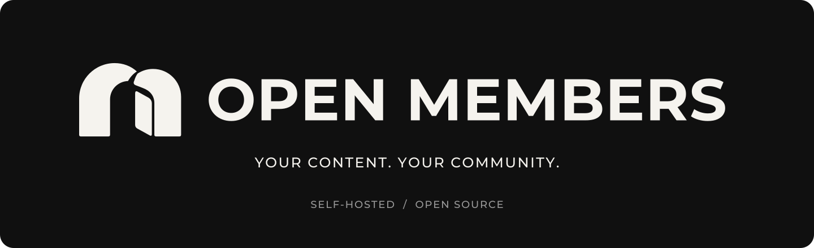
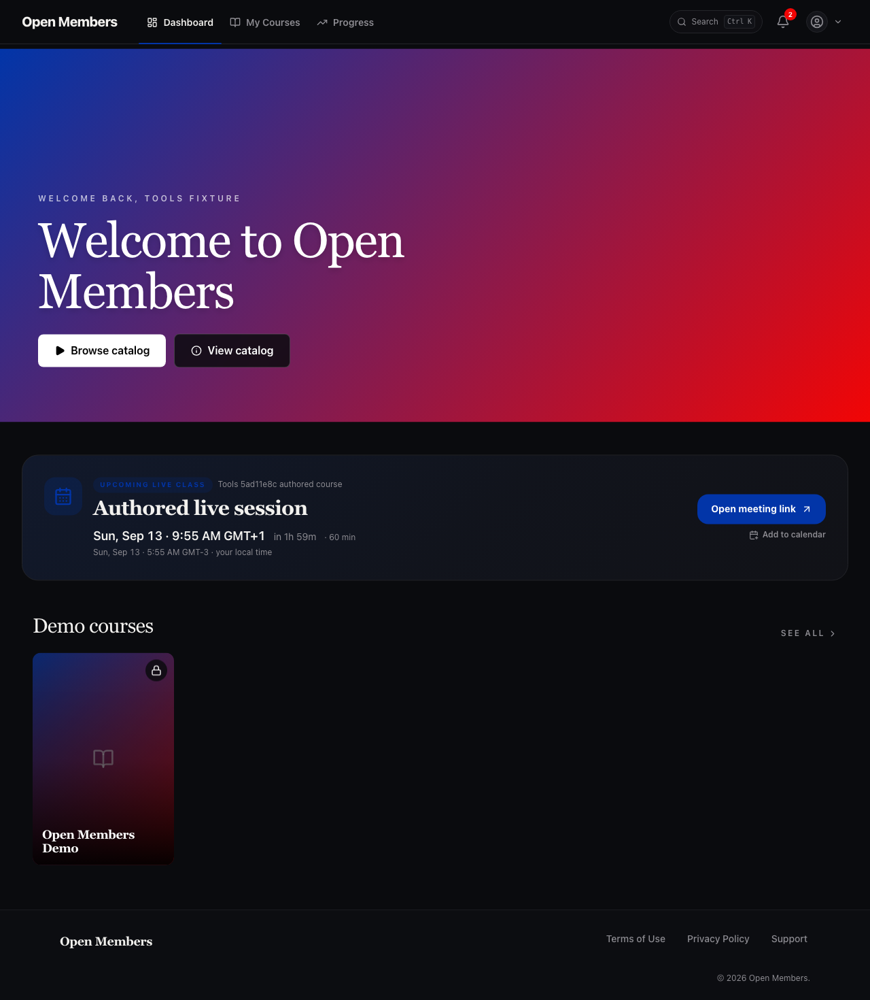
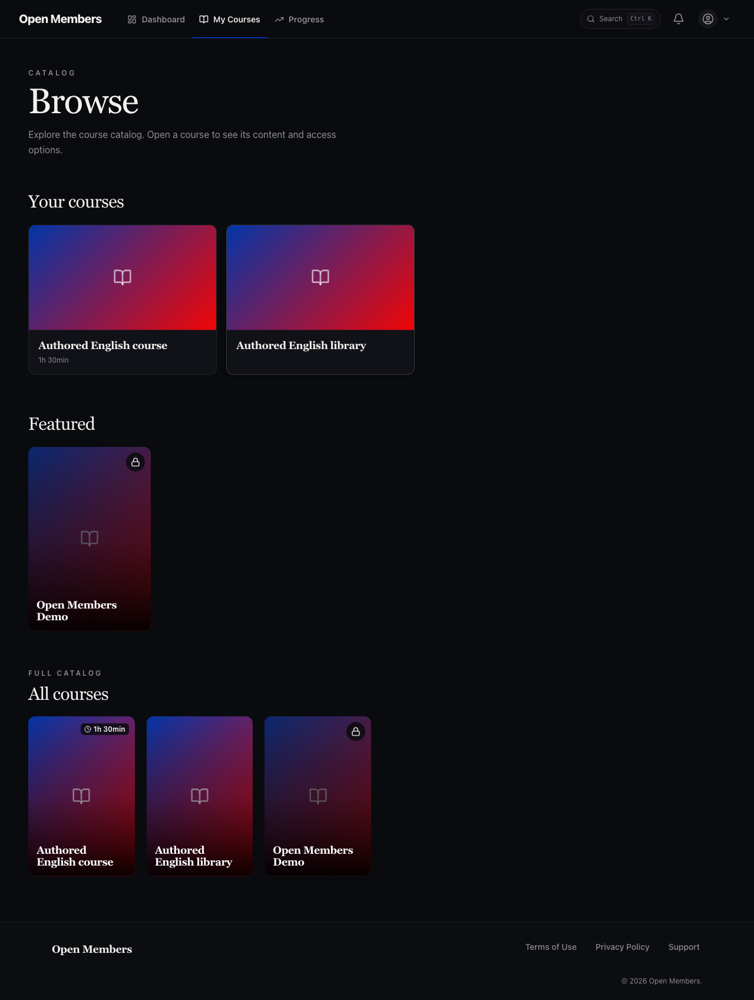
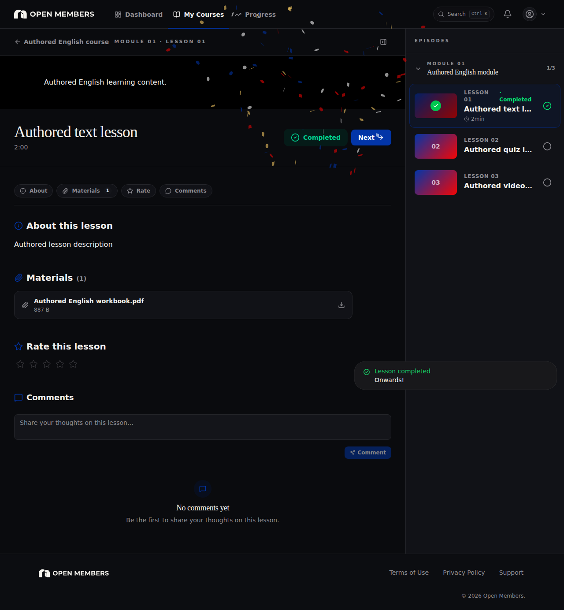
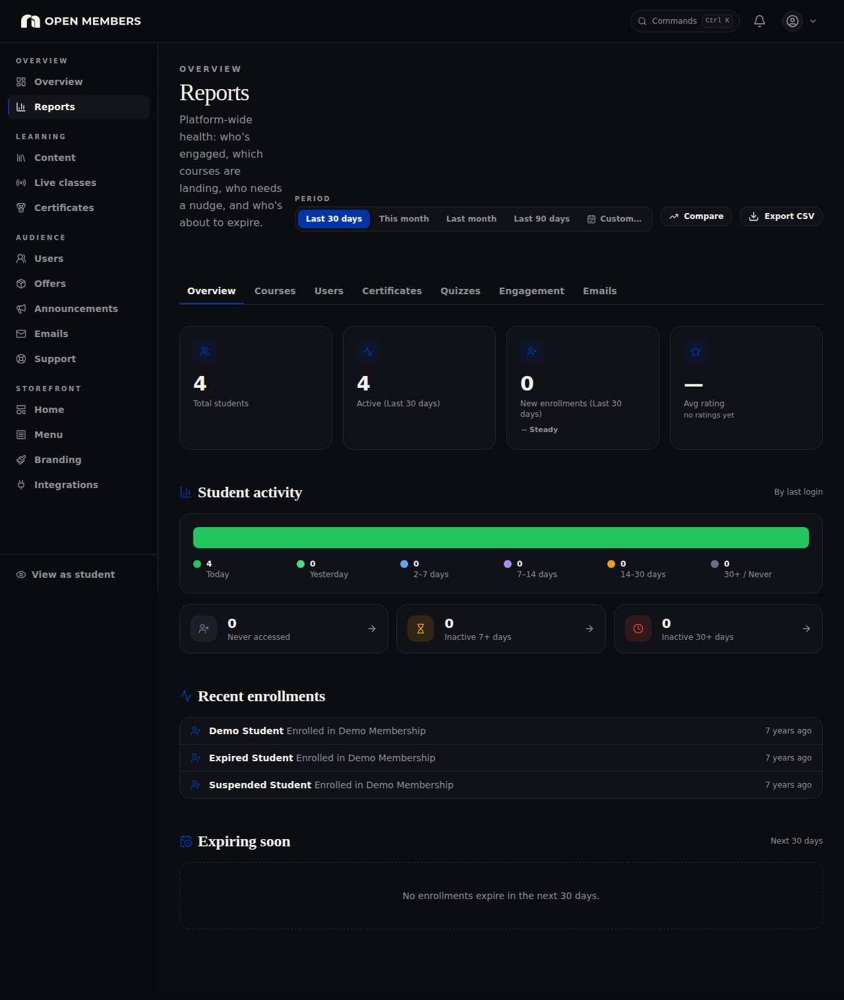
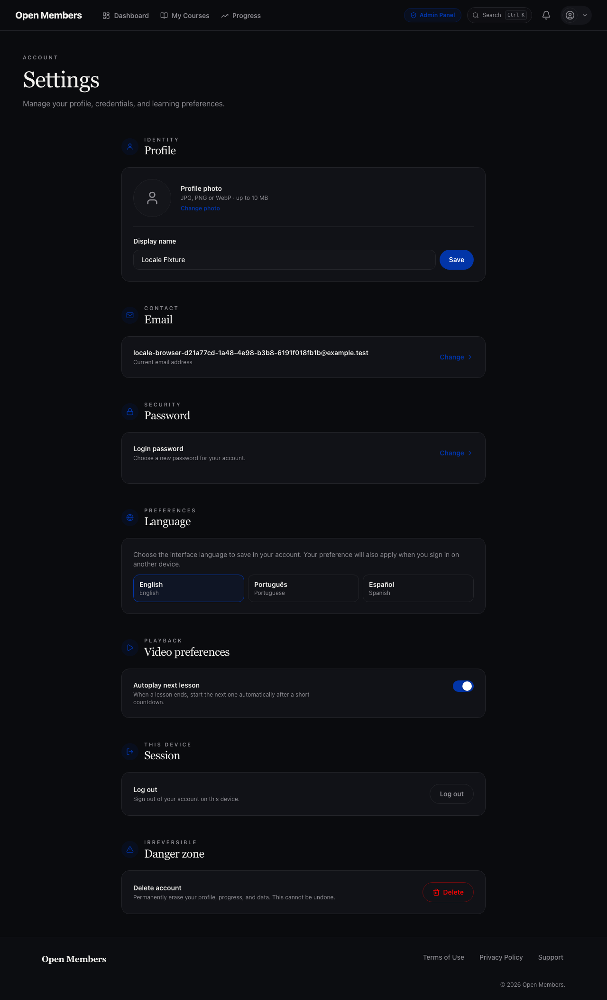
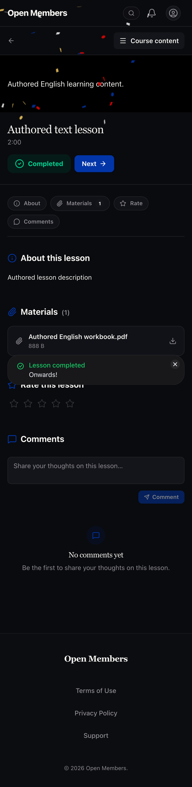
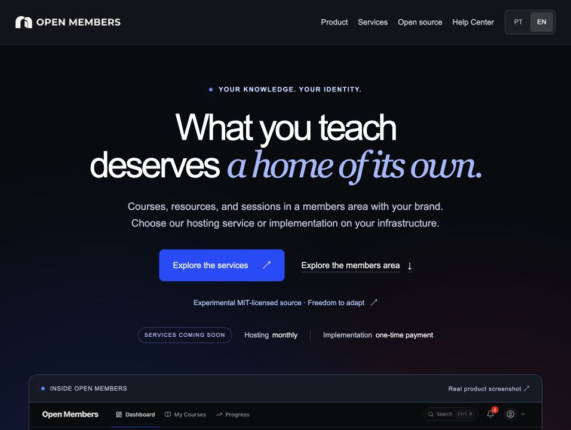
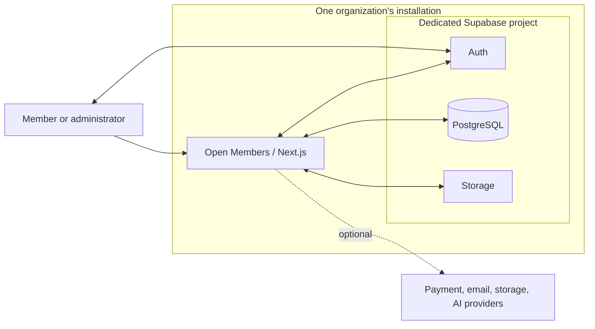

<p align="center">
  
</p>

<h1 align="center">What you teach deserves<br>a home of its own.</h1>

<p align="center">
  An open-source members area for courses, content, and learning communities.<br>
  <strong>Your brand. Your content. Your own installation.</strong>
</p>

<p align="center">
  <strong>Experimental</strong> · <a href="LICENSE">MIT</a> · TypeScript · English / Português / Español
</p>

<p align="center">
  <a href="#see-it-in-action">Product tour</a> ·
  <a href="#quickstart">Quickstart</a> ·
  <a href="#website-and-help-center">Website &amp; Help Center</a> ·
  <a href="#documentation">Documentation</a> ·
  <a href="CONTRIBUTING.md">Contribute</a>
</p>

Open Members brings learning, member access, progress, and administration together in an experience you can make your own. Create an independent home for your academy, learning community, or membership business.

**Self-hosted. MIT-licensed. Built to be yours.** The first-release model uses one application installation and one dedicated Supabase project per organization. The source is experimental; see the [current status and remaining validation](#project-status-and-limitations).

## See it in action

<p align="center">
  <a href="docs/images/dashboard.png">
    
  </a>
</p>

<p align="center"><em>A member's home: find your content and return to learning.</em></p>

<table>
  <tr>
    <td width="50%" valign="top">
      <a href="docs/images/course-catalog.png"></a>
      <p><strong>Explore the catalog</strong><br>Courses and content organized for members.</p>
    </td>
    <td width="50%" valign="top">
      <a href="docs/images/lesson-workspace.png"></a>
      <p><strong>Keep learning in one place</strong><br>A lesson workspace with course navigation.</p>
    </td>
  </tr>
  <tr>
    <td width="50%" valign="top">
      <a href="docs/images/admin-reports.png"></a>
      <p><strong>Understand member activity</strong><br>Administrative reporting and learning progress.</p>
    </td>
    <td width="50%" valign="top">
      <a href="docs/images/language-settings.png"></a>
      <p><strong>Choose your language</strong><br>English, Brazilian Portuguese, and Spanish preferences.</p>
    </td>
  </tr>
</table>

<details>
<summary><strong>View the mobile lesson experience</strong></summary>

<p align="center">
  <a href="docs/images/mobile-lesson.png">
    
  </a>
</p>

</details>

These application screenshots show the current Open Members identity with fictitious accounts and content. See the [image notes](docs/images/README.md) for capture details and scope.

## Website and Help Center

The product story and the technical guides, connected through one identity.

<p align="center">
  <a href="https://openmembers.club/en/">
    
  </a>
</p>

<p align="center"><em>Open Members website · Local preview</em></p>

| Explore the product | Find your next step |
| --- | --- |
| **[openmembers.club](https://openmembers.club/en/)** — a guided look at the member experience, customization, and planned services. | **[Help Center](https://openmembers.club/en/help/)** — searchable guides for installation, customization, operations, and contribution. |
| Product presentation in English and Portuguese. | A curated English and Portuguese edition of the repository documentation. |

The product website and Help Center are available in English and Portuguese. The image above shows a local website preview, not a hosted application demo. The [repository guides](#documentation) are also available directly in this checkout.

### Prefer help getting started?

Two optional services are in preparation. Self-hosting from the source remains an independent path.

| Managed hosting | Implementation service |
| --- | --- |
| **Monthly fee · Coming soon** | **One-time payment · Coming soon** |
| Your branded members area on infrastructure managed by Open Members. | Help installing and configuring Open Members on infrastructure you provide. |
| You focus on content; we plan to handle hosting. | One independent installation, with initial setup tailored to your organization. |
| Storage, video delivery, support, and service terms will be detailed before launch. | Infrastructure and third-party services have separate costs. Ongoing maintenance is not included by default. |

**Neither service is available for purchase yet.** Pricing, final scope, and terms will be announced before launch. Explore the [planned services](https://openmembers.club/en/#services), or start with the [local demo](#quickstart).

## What is included

| For members | For administrators |
| --- | --- |
| Course catalog, modules, and lesson workspace | Course, module, and lesson editing |
| Video lessons, attachments, and PDF reading | Member accounts, enrollments, and access management |
| Lesson progress and learning activity | Content organization, collections, and instructors |
| Lesson discussions and internal notifications | Announcements, support, and email-template interfaces |
| Profile settings, language, and appearance | Branding, navigation, and dashboard presentation |
| Support requests and course schedules | Reporting, CSV tools, and integration settings |

The code also includes configurable quizzes, certificates, content release schedules, cohorts, and live-class links. These features have different validation and configuration requirements; the [feature inventory](docs/features/overview.md) and [known limitations](docs/known-limitations.md) describe their scope and remaining checks. A screen or adapter being present does not mean its complete operational flow has passed acceptance.

**Three interface languages.** English, Brazilian Portuguese, and Spanish are selected through the profile preference. The localization work covers interface text, default notifications, emails, and generated documents. Authored course content, customized branding text, and saved template overrides keep the text supplied by the administrator. Final runtime localization acceptance remains open.

**Your installation, your identity.** Public configuration and the Branding panel control the name, imagery, colors, and presentation. Optional services have explicit requirements; the local demo works without payment, AI, or external email credentials.

## Quickstart

Run the demo from a reviewed source checkout or extracted source package. You need:

- **Node.js 22.23.2** and **npm 10.9.2**. The repository pins its toolchain in [`.nvmrc`](.nvmrc) and [`package.json`](package.json).
- A running, accessible **local Docker Engine** or **Docker Desktop**, plus space for dependencies and Supabase images.
- The project's local ports available: app `3000`, Supabase `55430`–`55434`. See the [development guide](docs/development.md) for the complete allocation.

The following example uses an already installed `nvm`:

```sh
nvm install
nvm use
npm ci --ignore-scripts --no-audit --no-fund

npm run db:start
npm run db:seed
npm run dev:local
```

Open **[localhost:3000](http://localhost:3000)**.

| Demo account | Role |
| --- | --- |
| `admin@example.test` | Superadministrator |
| `staff@example.test` | Administrator |
| `student@example.test` | Student with active enrollment |

All three use the public demo password **`OpenMembers-local-2026!`**. These are fictitious local fixtures, never production credentials. Additional visitor, expired, and suspended scenarios are listed in the [development guide](docs/development.md#install-and-open-the-demo).

`dev:local` gets credentials from the guarded local Supabase stack, injects them into the app, selects Mailpit, and disables optional provider credentials. You do **not** need an `.env.local` file, a hosted Supabase account, or `supabase link` for this demo. Confirmation and password-recovery messages appear in the **[local mailbox](http://127.0.0.1:55434)**; seeded accounts are already confirmed.

> [!IMPORTANT]
> The development scripts use a fixed project name and ports. Two checkouts on the same Docker daemon share this stack. Use a dedicated local test environment; do not connect an existing production database or another organization's services.

Stop the app with `Ctrl+C`. Stop this project's database services while preserving their data with `npm run db:stop`. Repeating `db:seed` restores the declared demo fixtures. **`db:reset` deletes this project's local database; it is not part of the quickstart.**

For a UI preview without a database, run `npm run dev` without Supabase variables. The public entry and setup experience are available; member and administrator pages direct to `/setup` until configured.

## Make it yours

Create a local presentation file:

```sh
cp openmembers.config.example.json openmembers.config.json
```

Edit its public identity, colors, and links. For example, these values can be part of the configuration:

```json
{
  "branding": {
    "site_name": "My Learning Community",
    "primary_color": "#0f766e",
    "accent_color": "#b45309",
    "font_family": "system"
  },
  "public": {
    "title": "A place to keep learning"
  }
}
```

The local file is ignored by Git and contains **presentation only**, never service credentials. `OPENMEMBERS_CONFIG_FILE` can select a different path. Branding resolves from built-in defaults, then the file, then valid settings saved in **Admin → Branding**. Saved administrative branding takes precedence over file defaults.

The [customization guide](docs/customization.md) covers logos, dark/light presentation, metadata, dashboard settings, policy links, and deployment mounts. Each installation supplies its own support destinations, terms, and privacy policy.

## Architecture

| Layer | Technology |
| --- | --- |
| Application | Next.js 16, React 19, TypeScript |
| Interface | Tailwind CSS 4, HeroUI 3, next-intl |
| Identity and data | Supabase Auth, PostgreSQL, row-level security |
| Files | Supabase Storage; optional R2 adapter |
| Verification | Vitest, Playwright, Node tooling and database contracts |
| Reference deployment | Standalone Next.js application in Docker Compose on Linux |

Exact dependency versions are recorded in [`package-lock.json`](package-lock.json).



Server credentials stay on the server. Browser/session clients use the public Supabase configuration, while privileged operations use server-side authorization and the installation's administrative client. Read the [installation model and access boundaries](docs/README.md#installation-model) before extending data access or changing the installation model.

<details>
<summary><strong>Repository map</strong></summary>

| Path | Contents |
| --- | --- |
| `app/` | Pages, layouts, and HTTP endpoints |
| `features/` | Member and administrator features |
| `core/` | Configuration, access helpers, authentication clients, and shared services |
| `shared/` | Reusable interface components, types, and utilities |
| `lib/` | Provider adapters and application services |
| `supabase/` | Local configuration and versioned migrations |
| `scripts/`, `tests/`, `e2e/` | Guarded tooling and verification suites |
| `deploy/` | Container configuration and Linux job templates |
| `docs/` | Development, installation, feature, and operations guides |
| `website/` | Independent product website and curated Help Center |

</details>

## Optional integrations

Use only services and content you are authorized to operate. Configuration and local adapter tests do not establish provider validation.

| Integration | Current scope |
| --- | --- |
| Stripe, Guru, generic webhooks | Optional payment/enrollment adapters; provider-specific flows require their own test environment |
| Mailpit / Resend | Local email capture / optional external delivery; Supabase Auth email is configured separately |
| Supabase Storage / R2 | Core public branding and private attachments / optional configured R2 storage |
| YouTube / Vimeo | Administrator-supplied video embeds, subject to the video's access and embed policy |
| Course AI chat | Experimental, disabled by default; requires explicit opt-in, credentials, and an authorized corpus. An ingestion pipeline is not included |
| Google / Apple OAuth | Server-side opt-in exists; the social sign-in interface and full flow are not delivered |
| GA4, Meta Pixel, Sentry | Optional installation-owned telemetry, disabled without configuration |
| Push / offline experience | New push subscriptions are disabled; a manifest is included, but a delivery/offline worker is not |

See the [integration matrix](docs/integrations/README.md), [payments guide](docs/integrations/payments.md), [email and jobs guide](docs/integrations/email-jobs.md), and [storage guide](docs/integrations/storage.md) for setup, behavior when disabled, and remaining validation. A Hotmart route exists as a candidate adapter; it is not an operationally supported integration.

## Deployment and operations

The reference deployment uses **Docker Compose on Linux and a new Supabase project owned by the organization**. Follow the [installation guide](docs/deployment/installation.md) for migrations, Auth, first-administrator provisioning, HTTPS, and configuration. Local `db:*` and `admin:create` scripts are not hosted deployment tools.

The [Compose template](deploy/compose.yaml) runs the standalone app as a non-root user, binds its application port to host loopback, and mounts presentation configuration read-only. Public Next.js values are embedded at build time; changing the Supabase URL, public key, or public origin requires rebuilding. Keep server secrets in the private runtime environment, as described in [`.env.example`](.env.example).

The [operations guide](docs/deployment/operations.md) covers health, backups, recovery, updates, the five-job executor, and systemd templates. Job endpoints do not schedule themselves. Linux timer execution and an installation by a new operator remain release acceptance items. The repository does not currently provide a published container image or a hosted demo.

## Verification

With dependencies installed and external providers unconfigured, start with:

```sh
npm run check
npm run lint
npm test
npm run test:tooling
```

`check` generates route types and checks TypeScript. Vitest covers application behavior; Node tooling tests cover guards and operational helpers. Documentation-only changes normally need content, links, and rendering review rather than application tests.

<details>
<summary><strong>Build and public browser checks</strong></summary>

```sh
npm run build
npm run verify:artifact
npx playwright install chromium
npm run test:e2e
npm run test:e2e:branding
```

The artifact check inspects build tracing for private/local material. Public browser suites use unconfigured `localhost:3100` and a second fictitious identity at `localhost:3102`, covering desktop/mobile and light/dark presentation. Chromium installation may download browser files; Linux system-library requirements are documented in the [development guide](docs/development.md#verify-a-change).

</details>

<details>
<summary><strong>Configured database and browser checks</strong></summary>

On the dedicated local development stack, after creating the demo fixtures:

```sh
OPENMEMBERS_DATABASE_TEST_TARGET=development npm run db:test
npm run build:local
npm run test:e2e:db
```

Database contracts create and clean up their own test records. The authenticated browser suite uses `localhost:3101` and tests against a build for that same local database. The stronger clean-install command, **`npm run db:verify`, resets the local development database twice**; use it only on a disposable stack. It does not target the separate pilot or recovery installation. Consult the [development guide](docs/development.md) before running destructive checks.

</details>

After committing, run `npm run verify:source` from a clean tracked Git checkout. It checks the exact `HEAD` snapshot for prohibited local files and documented credential signatures. It refuses staged/unstaged tracked changes and does not scan untracked files or previous commits. Read the [source verification guide](docs/source-verification.md) for the limits and separate final-package review.

[CI](.github/workflows/ci.yml) defines quality and isolated database jobs without hosted-service credentials. Run results apply only to the revision and environment tested. The [known limitations](docs/known-limitations.md) include browser, installation, and provider coverage gaps, including intermittent branding-test failures. The YouTube integration test requires explicit opt-in because it contacts an external provider; see the [player guide](docs/features/player.md).

## Project status and limitations

> **Experimental software.** Open Members has no stable release or supported production version. The package version `0.1.0` is development metadata.

The application includes configurable branding, a fictitious local demo, versioned database migrations, and English, Brazilian Portuguese, and Spanish interfaces. Screenshots document the source revision recorded in the [image notes](docs/images/README.md). They do not certify every feature in the current source.

Known limitations include:

- Intermittent authenticated branding-test failures around the installation name after upload/polling and navigation to login; their cause is unresolved.
- Incomplete integrated browser, localization, signed-download, and recovery-interface validation.
- A Linux deployment reference that still lacks end-to-end validation by an independent operator, including actual scheduled jobs, backup, and recovery.
- A private vulnerability reporting channel that is not currently available as verified; see [SECURITY.md](SECURITY.md) for the reporting procedure.
- Optional providers that require installation-specific configuration and tests.

Read the [known limitations](docs/known-limitations.md) before choosing an installation or enabling optional services. Successful checks apply to the revision and environment tested.

## Documentation

Start with the [documentation index](docs/README.md) to choose a path. The [Help Center](https://openmembers.club/en/help/) provides searchable, curated English and Portuguese guides. Detailed source guides retain the languages shown below.

| Your next step | Guide | Language |
| --- | --- | --- |
| Run the fictitious demo | [Local development](docs/development.md) | English |
| Shape the experience | [Customization](docs/customization.md) | Portuguese |
| Prepare an independent installation | [Installation](docs/deployment/installation.md) · [Operations](docs/deployment/operations.md) | Portuguese |
| Understand features and providers | [Features](docs/features/overview.md) · [Integrations](docs/integrations/README.md) | Portuguese |
| Make a contribution | [Contributing](CONTRIBUTING.md) · [Source verification](docs/source-verification.md) | English |
| Review current limits | [Known limitations](docs/known-limitations.md) · [Security policy](SECURITY.md) | English |
| Check distribution requirements | [License](LICENSE) · [Third-party notices](THIRD_PARTY_NOTICES.md) | English |

Translations and improvements to the installation guides are welcome alongside code contributions.

## Contribute

Read [CONTRIBUTING.md](CONTRIBUTING.md), run the fictitious local demo, and choose a scoped change from the [known limitations](docs/known-limitations.md). Useful contributions include clearer installation instructions, localization, accessibility, reproducible bug reports, and tests for the open acceptance items.

Describe the intended behavior and scope in an issue or pull request, following the contribution guide. Use fictitious data and services you control. Do not include credentials, private content, or another organization's history in a contribution. Include the verification relevant to the change and state what was not tested.

## Security and license

**Security reports:** Read [SECURITY.md](SECURITY.md) to check the availability of GitHub Private Vulnerability Reporting and request a private alternative. The channel is not currently available as verified. Do not post vulnerability details in public issues or pull requests; no response-time or supported-release commitment has been established.

**License:** Open Members source is provided under the [MIT License](LICENSE). Third-party packages and assets retain their own licenses and notices; see [THIRD_PARTY_NOTICES.md](THIRD_PARTY_NOTICES.md). Review the composition and applicable notices separately before distributing compiled bundles, executables, or container images.
