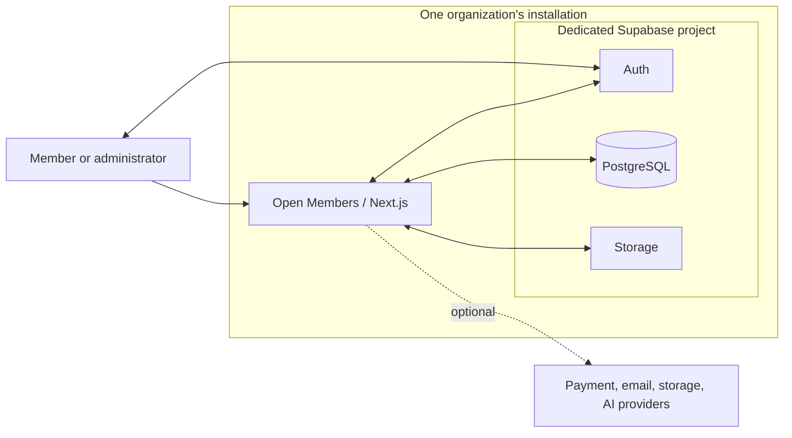

O Open Members reúne cursos, acesso de membros, progresso e administração em uma aplicação. O modelo atual usa uma instalação da aplicação e um projeto Supabase por organização. Este guia apresenta seções selecionadas do README do projeto.

## O que está incluído

| Para alunos | Para administradores |
| --- | --- |
| Catálogo de cursos, módulos e ambiente de aulas | Edição de cursos, módulos e aulas |
| Videoaulas, anexos e leitura de PDF | Contas de membros, matrículas e gestão de acesso |
| Progresso nas aulas e atividade de aprendizado | Organização de conteúdos, coleções e instrutores |
| Discussões nas aulas e notificações internas | Interfaces de comunicados, suporte e modelos de e-mail |
| Preferências de perfil, idioma e aparência | Marca, navegação e apresentação do painel inicial |
| Solicitações de suporte e agenda dos cursos | Relatórios, ferramentas CSV e configurações de integrações |

O código também inclui questionários, certificados, agendamento de liberação de conteúdo, turmas e links de aulas ao vivo configuráveis. Esses recursos têm requisitos distintos de validação e configuração; o [inventário de recursos](docs/features/overview.md) e as [limitações conhecidas](docs/known-limitations.md) descrevem seu alcance e as verificações pendentes. A presença de uma tela ou adaptador não significa que seu fluxo operacional completo passou no aceite.

**Três idiomas de interface.** Inglês, português brasileiro e espanhol são selecionados pela preferência do perfil. O trabalho de localização cobre textos de interface, notificações padrão, e-mails e documentos gerados. Conteúdo de cursos, textos personalizados de marca e alterações salvas de modelos preservam o texto fornecido pelo administrador. O aceite final de localização em execução permanece pendente.

**Sua instalação, sua identidade.** A configuração pública e o painel de marca controlam nome, imagens, cores e apresentação. Serviços opcionais têm requisitos explícitos; a demonstração local funciona sem credenciais de pagamento, IA ou e-mail externo.

## Personalize

Crie um arquivo local de apresentação:

```sh
cp openmembers.config.example.json openmembers.config.json
```

Edite sua identidade pública, cores e links. Por exemplo, estes valores podem fazer parte da configuração:

```json
{
  "branding": {
    "site_name": "My Learning Community",
    "primary_color": "#0f766e",
    "accent_color": "#b45309",
    "font_family": "system"
  },
  "public": {
    "title": "A place to keep learning"
  }
}
```

O arquivo local é ignorado pelo Git e contém **somente apresentação**, nunca credenciais. `OPENMEMBERS_CONFIG_FILE` pode selecionar outro caminho. A marca é resolvida a partir dos valores padrão, depois do arquivo, e então das configurações válidas salvas em **Admin → Branding**, o painel de marca. A configuração administrativa salva prevalece sobre os valores do arquivo.

O [guia de personalização](docs/customization.md) cobre logos, apresentação clara/escura, metadados, configurações do painel inicial, links de políticas e montagens na implantação. Cada instalação fornece seus próprios destinos de suporte, termos e política de privacidade.

## Arquitetura

| Camada | Tecnologia |
| --- | --- |
| Aplicação | Next.js 16, React 19, TypeScript |
| Interface | Tailwind CSS 4, HeroUI 3, next-intl |
| Identidade e dados | Supabase Auth, PostgreSQL, segurança por linha |
| Arquivos | Supabase Storage; adaptador R2 opcional |
| Verificação | Vitest, Playwright, ferramentas Node e contratos de banco |
| Implantação de referência | Aplicação Next.js independente em Docker Compose no Linux |

As versões exatas das dependências estão em [`package-lock.json`](package-lock.json).



As credenciais de servidor permanecem no servidor. Clientes de navegador/sessão usam a configuração pública do Supabase, enquanto operações privilegiadas usam autorização no servidor e o cliente administrativo da instalação. Leia o [modelo de instalação e os limites de acesso](docs/README.md#installation-model) antes de ampliar o acesso a dados ou mudar o modelo de instalação.

| Caminho | Conteúdo |
| --- | --- |
| `app/` | Páginas, layouts e pontos de acesso HTTP |
| `features/` | Recursos de alunos e administradores |
| `core/` | Configuração, auxiliares de acesso, clientes de autenticação e serviços compartilhados |
| `shared/` | Componentes de interface, tipos e utilitários reutilizáveis |
| `lib/` | Adaptadores de provedores e serviços da aplicação |
| `supabase/` | Configuração local e migrações versionadas |
| `scripts/`, `tests/`, `e2e/` | Ferramentas protegidas e suítes de verificação |
| `deploy/` | Configuração de contêineres e modelos de tarefas Linux |
| `docs/` | Guias de desenvolvimento, instalação, recursos e operação |
| `website/` | Site institucional independente e Central de ajuda com guias selecionados |

## Integrações opcionais

Use apenas serviços e conteúdos que você está autorizado a operar. Configuração e testes locais de adaptadores não comprovam a validação do provedor.

| Integração | Alcance atual |
| --- | --- |
| Stripe, Guru, webhooks genéricos | Adaptadores opcionais de pagamento/matrícula; fluxos específicos exigem ambiente de teste próprio |
| Mailpit / Resend | Captura local de e-mail / envio externo opcional; e-mails do Supabase Auth são configurados separadamente |
| Supabase Storage / R2 | Marca pública e anexos privados no núcleo / armazenamento R2 configurado opcional |
| YouTube / Vimeo | Vídeos incorporados fornecidos pelo administrador, conforme as políticas de acesso e incorporação do vídeo |
| Chat de curso com IA | Experimental, desativado por padrão; exige adesão explícita, credenciais e uma base de conteúdo autorizada. Não inclui um fluxo de ingestão |
| Google / Apple OAuth | Existe adesão no servidor; interface de login social e fluxo completo não foram entregues |
| GA4, Meta Pixel, Sentry | Telemetria opcional da instalação, desativada sem configuração |
| Notificações push / experiência sem rede | Novas inscrições push estão desativadas; há manifesto, mas não um processo de entrega ou funcionamento sem rede |

Consulte a [matriz de integrações](docs/integrations/README.md), o [guia de pagamentos](docs/integrations/payments.md), o [guia de e-mail e tarefas](docs/integrations/email-jobs.md) e o [guia de armazenamento](docs/integrations/storage.md) para configuração, comportamento quando desativado e validações pendentes. Existe uma rota Hotmart como adaptador candidato; ela não é uma integração com suporte operacional.

## Estado do projeto e limitações

> **Software experimental.** O Open Members não possui lançamento estável nem versão com suporte de produção. A versão `0.1.0` do pacote é um metadado de desenvolvimento.

A aplicação inclui marca configurável, demonstração local fictícia, migrações versionadas do banco e interfaces em inglês, português brasileiro e espanhol. As capturas ilustram uma revisão local anterior. Elas não certificam todos os recursos do código atual.

As limitações conhecidas incluem:

- Falhas intermitentes nos testes autenticados de marca envolvendo o nome da instalação após envio de imagem e consultas periódicas, além da navegação para o login; a causa permanece sem resolução.
- Validação incompleta dos fluxos integrados de navegador, localização, download assinado e interface de recuperação.
- Uma referência de implantação Linux ainda sem validação de ponta a ponta por um operador independente, incluindo tarefas agendadas reais, backup e recuperação.
- Um canal privado de relato de vulnerabilidades que não está disponível atualmente como verificado; veja o procedimento de relato em [SECURITY.md](SECURITY.md).
- Provedores opcionais que exigem configuração e testes específicos da instalação.

Leia as [limitações conhecidas](docs/known-limitations.md) antes de escolher uma instalação ou ativar serviços opcionais. Verificações bem-sucedidas se aplicam à revisão e ao ambiente testados.

## Segurança e licença

**Relatos de segurança:** Leia [SECURITY.md](SECURITY.md) para conferir a disponibilidade do GitHub Private Vulnerability Reporting e solicitar uma alternativa privada. O canal não está disponível atualmente como verificado. Não publique detalhes de vulnerabilidades em issues ou pull requests públicos; não há compromisso estabelecido de prazo de resposta nem de versões com suporte.

**Licença:** o código do Open Members é fornecido sob a [licença MIT](LICENSE). Pacotes e assets de terceiros preservam suas próprias licenças e avisos; veja [THIRD_PARTY_NOTICES.md](THIRD_PARTY_NOTICES.md). Revise a composição e os avisos aplicáveis separadamente antes de distribuir pacotes compilados, executáveis ou imagens de contêiner.
